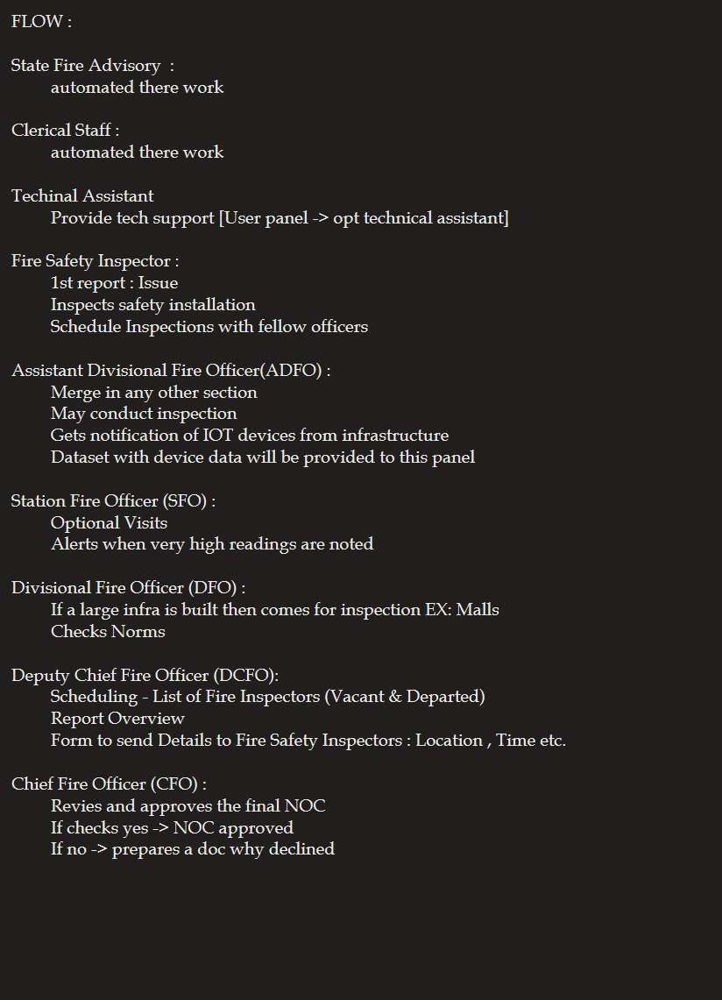



# Fire NOC Application System(Sanrakshan)

## Overview

The Fire NOC Application System is a comprehensive, web-based solution designed to digitalize and automate the process of applying for, evaluating, and issuing Fire No Objection Certificates (NOC). This system streamlines the application process, enables real-time tracking, and leverages AI to enhance safety and compliance measures. Future integration with IoT devices is planned to further improve fire safety monitoring and response.

## Features

### User Interface
- **User-Friendly Dashboard:** Simplified and intuitive interface for applicants and officials.
- **Multi-Panel Access:** Dedicated web panels for applicants, fire department officials, and inspectors.
- **Real-Time Tracking:** Monitor application progress and status updates in real-time.
- **Document Management:** Secure upload and management of required documents.
- **Automated Notifications:** Instant alerts for application progress, approvals, or required actions.

### AI Integration
- **Application Segregation:** AI categorizes applications based on institution type, size, and fire risk factors.
- **Risk Assessment:** AI-driven analysis of potential fire hazards and recommended safety measures.
- **Compliance Verification:** Automated document checks for completeness and adherence to regulations.
- **Predictive Analytics:** Uses historical data to predict fire risks and suggests preventive measures.
- **Smart Notifications:** AI-based alerts for high-risk applications and required actions.

### Future IoT Integration
- **IoT-Enabled Fire Detection:** Integration with smoke detectors, temperature sensors, and fire alarms.
- **Smart Sprinkler Systems:** Automated sprinklers with real-time monitoring and control.
- **Centralized Monitoring Dashboard:** Collects data from all IoT devices for real-time analysis.
- **Emergency Response Automation:** Automated alerts and systems control during fire emergencies.

## Installation

### Prerequisites
- Node.js
- MongoDB
- Express.js
- React.js

### Setup Instructions
1. **Clone the repository:**
   ```bash
   git clone https://github.com/yourusername/fire-noc-system.git
   cd fire-noc-system
   ```

2. **Install dependencies:**
   ```bash
   npm install
   ```

3. **Set up environment variables:**
   - Create a `.env` file in the root directory.
   - Add your MongoDB connection string and other environment variables.

4. **Run the application:**
   ```bash
   npm start
   ```

5. **Access the application:**
   - Open your web browser and navigate to `http://localhost:5000`.

## Usage

### For Applicants:
- Register and log in to submit a Fire NOC application.
- Upload necessary documents and track application progress in real-time.
- Receive notifications and alerts for any required actions.

### For Fire Department Officials:
- Log in to access assigned applications.
- Review documents, conduct inspections, and issue approvals or rejections.
- Communicate with applicants through the platform.

### For Inspectors:
- Log in to view inspection schedules.
- Access application details and submit inspection reports.
- Track inspection history and compliance status.

## Contribution

We welcome contributions to enhance the functionality of this project. Please follow these steps to contribute:
1. Fork the repository.
2. Create a new branch for your feature or bug fix.
3. Make your changes and commit them.
4. Push to your fork and submit a pull request.

## License

This project is licensed under the MIT License. See the [LICENSE](LICENSE) file for more details.

## Future Plans

- **IoT Device Integration:** Implement IoT devices for real-time fire safety monitoring.
- **Mobile App Development:** Extend the platform to mobile devices for easier access.
- **Advanced AI Features:** Enhance AI capabilities for more detailed risk assessments and predictions.

## Contact

For any queries or support, please contact the project team at [This Email](mailto:ayushtomarrudra@gmail.com).

---

 # Work Flow
 


 # Procedure
 


 # Website Outlay
 


 # UserPanel
 


 # IoT
 


